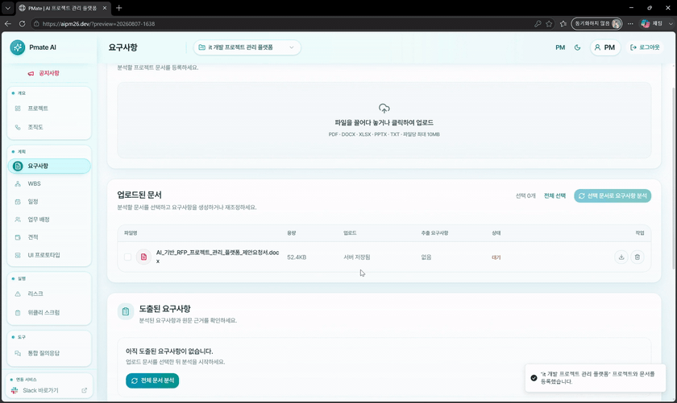

# PMate Backend

> PMate의 인증, 프로젝트 데이터, AI 연동 및 비즈니스 로직을 담당하는 Spring Boot API Server

PMate Backend는 Frontend와 AI Server 사이의 애플리케이션 경계입니다. 사용자와 프로젝트 권한을 확인하고, 프로젝트 계획·실행 데이터를 트랜잭션으로 관리하며, AI 요청에 필요한 컨텍스트를 조립한 뒤 응답을 검증해 저장합니다.

문서 원본과 생성 이미지는 Object Storage에, 관계형 도메인 데이터와 AI 실행 상태는 Database에 분리해 보관합니다.

---

## Overview

- `PM` / `STAFF` 역할과 프로젝트 단위 접근 권한을 적용합니다.
- 프로젝트 초안부터 요구사항, WBS, 일정, 인력 배정, 진척도까지 계획 상태를 연결합니다.
- 업로드 문서를 S3에 저장하고, 분석 결과와 문서 근거(Evidence)를 RDS MySQL에 영속화합니다.
- FastAPI AI Server에 문서 분석·계획·산출물·리스크·보고 요청을 전달하고 응답 계약을 검증합니다.
- GitHub Actions에서 테스트한 실행 JAR를 EC2에 배포하고, systemd·Nginx·Actuator로 운영합니다.

---

## Core Responsibilities

| 영역 | Backend가 담당하는 일 |
| --- | --- |
| 인증·인가 | 이메일 인증이 포함된 가입/로그인 흐름, JWT Access Token, Refresh Token, `PM` / `STAFF` 권한 검사 |
| 프로젝트 | 초안 생성, 상세·목록 조회, 확정, 삭제, 멤버 구성과 프로젝트 단위 접근 제어 |
| 문서·요구사항 | 파일 검증과 S3 저장, AI 문서 추출, 요구사항 CRUD·확정·재조정, 원문 Evidence 추적 |
| WBS·일정 | 확정 요구사항 기반 비동기 WBS 생성, 편집본 저장, 선행 관계와 3개 일정 시나리오 관리 |
| 자원·업무 | 역량·가용 시간을 반영한 배정 추천, 최종 담당자 저장, 개인·팀 진척도와 지연 업무 조회 |
| 산출물 | 필수 산출물 등록 상태, 버전·승인 상태, 조직도와 UI Mockup 생성물 저장·다운로드 |
| 리스크 | 커뮤니케이션 리스크, 변경 영향도, 팀원 지연, 재배정 추천, 산출물 보안 검사 요청 조율 |
| 보고·Assistant | 프로젝트 컨텍스트 기반 질의, STAFF 주간 스크럼 제출, PM 검토를 포함한 주간 보고 Workflow |

---

## Architecture

```text
React Frontend (Vercel)
          │
          │ REST API + Bearer JWT
          ▼
      Nginx (EC2)
          │
          ▼
Spring Boot API Server (systemd)
  ├─ Spring Security ───── JWT 인증, PM/STAFF 인가
  ├─ Domain Services ───── 프로젝트·요구사항·WBS·일정·업무·리스크
  ├─ Spring Data JPA ───── AWS RDS MySQL
  ├─ DocumentObjectStorage ─ AWS S3 / local 개발 저장소
  └─ RestClient ────────── FastAPI AI Server
```

현재 운영 문서 기준으로 Backend와 AI Server는 EC2 내부 Loopback으로 통신합니다. RDS와 S3는 애플리케이션 런타임과 별도로 관리하며, Frontend 요청은 Nginx가 `127.0.0.1:8080`의 Spring Boot로 전달합니다.

### Request Lifecycle

```text
HTTP Request
  → JWT Filter
  → Controller DTO Validation + Role Check
  → Project Ownership / Membership Check
  → Domain Service
     ├─ Repository Transaction
     ├─ S3 Object I/O
     └─ AI Server Request + Response Validation
  → Response DTO
```

AI Server가 분석·추천·생성을 수행하더라도, 어떤 프로젝트 데이터를 보낼지 결정하고 응답의 프로젝트·문서·업무 식별자를 검증하며 저장 상태를 관리하는 책임은 Backend에 있습니다.

---

## Document Analysis & Evidence Flow

```text
PM 문서 업로드
  → 확장자·MIME·크기·중복 파일명 검증
  → S3 Object 저장 + ProjectDocument 메타데이터 저장
  → 프로젝트 소유권과 선택 문서 범위 확인
  → S3에서 파일을 읽어 AI Server에 Multipart 전송
  → AI 응답 구조와 문서 매핑 검증
  → 분석 결과·요구사항·Evidence를 하나의 저장 흐름으로 반영
  → Frontend에 요구사항 검토 데이터 반환
```

- 허용 형식은 설정 기준 `pdf`, `docx`, `xlsx`, `pptx`, `txt`이며 파일 수·크기도 서버에서 제한합니다.
- S3 Object Key는 `projects/{projectId}/documents/...` 범위로 생성하고, AI Server에는 공개 URL이나 Object Key 대신 파일 본문과 `document_id` / 파일명 Manifest를 전달합니다.
- Evidence는 요구사항과 원본 문서를 연결하며 페이지, Chunk ID, 인용문, Offset, Bounding Box 정보를 저장할 수 있습니다.
- 분석 중 입력 문서나 프로젝트가 변경되면 저장 전 다시 확인해 오래된 AI 결과가 현재 상태를 덮지 않도록 합니다.
- Evidence가 참조하는 문서는 삭제·교체할 수 없도록 충돌을 반환합니다.

---

## Demo

### 문서 분석 요청과 요구사항 반영

선택한 프로젝트 문서를 기준으로 Backend가 AI 분석을 조율하고, 저장된 요구사항 검토 데이터를 Frontend에 반환하는 사용자 관점의 흐름입니다.

<p align="center">
  
</p>

---

## API Domains

모든 Endpoint를 나열하기보다 Controller가 제공하는 책임 단위로 정리했습니다.

| Domain | 대표 경로 | 주요 동작 | 권한 |
| --- | --- | --- | --- |
| Auth & User | `/api/users/**` | 가입·로그인 검증, 세션 갱신·종료, 비밀번호 재설정, 사용자 역량 저장 | 공개 Auth / 인증 사용자 |
| Project | `/api/projects/**` | 프로젝트 목록·상세·초안·확정·삭제 | PM, STAFF |
| Document | `/api/projects/{id}/documents/**` | 업로드·조회·PDF 열람·삭제·AI 추출·분석 결과 | PM 중심, 일부 조회 STAFF |
| Requirement | `/api/projects/{id}/requirements/**` | 분석·재조정·검토·적용·CRUD·확정 | PM |
| WBS & Schedule | `/api/projects/{id}/wbs/**`, `/schedules/**` | 비동기 WBS 생성 상태, 최초안/최종안, 일정 생성·확정 | PM, 일정 조회 STAFF |
| Resource & Work | `/team-members`, `/assignments`, `/tasks`, `/progress` | 팀 구성, 담당자 추천·확정, 개인·팀 업무와 진척도 | PM, STAFF 역할별 분리 |
| Cost | `/api/projects/{id}/costs/**` | AI 견적, 공수·KOSA 기준 계산, 편집값 서버 재계산·확정 | PM |
| Artifact | `/artifacts/status`, `/artifacts/organization-chart/**`, `/artifacts/ui-mockup/**` | 산출물 상태, 생성·계층 편집·평가·버전 저장·다운로드 | PM, 일부 조회 STAFF |
| Assistant & Scrum | `/assistant/query`, `/weekly-scrums/**` | 프로젝트 질의, 주간 제출·분석·PM Review·최종 보고 | PM, STAFF 역할별 분리 |
| Risk | `/communication-risks`, `/impact-analysis`, `/member-delay`, `/deliverables/**/security-check` | 커뮤니케이션·변경·지연·재배정·보안 검사 | PM |

OpenAPI 문서는 실행 환경의 `/swagger-ui/index.html`, 명세 JSON은 `/v3/api-docs`에서 확인할 수 있습니다.

---

## AI Integration

Backend는 Spring `RestClient`로 AI Server를 호출합니다. 연결·읽기 Timeout과 Endpoint는 환경 변수로 교체할 수 있으며, HTTP 오류·Timeout·빈 응답·식별자 불일치를 애플리케이션 오류로 변환합니다.

| 기능 | Backend가 조립하는 입력 | Backend가 검증·저장하는 결과 |
| --- | --- | --- |
| 문서 추출·요구사항 재조정 | 권한 검증된 문서 파일, 문서 Manifest, 기존 요구사항 | 프로젝트 분석 Snapshot, 요구사항, Evidence, 변경 후보와 검토 상태 |
| WBS | 프로젝트 정보, 확정 요구사항, 핵심 기능, 필수 산출물 | 생성 작업 상태, AI 최초안, 계층형 Task, 요구사항·산출물 Coverage, 사용자 최종안 |
| 일정 | 확정 WBS와 프로젝트 계획 기간 | `expected` / `recommended` / `conservative` 시나리오, 선행 관계, Milestone, 경고 |
| 자원·배정 | WBS, 팀원 역할·역량·가용 시간 | 필요 인력, 추천 담당자, 배정 시간, 제외·미배정 경고 |
| 조직도 | 확정 계획과 프로젝트 멤버 | 구조화된 조직 정보, 렌더링 이미지, 계층 편집본, Version |
| UI Mockup | 프로젝트와 확정 요구사항 | JPEG 이미지, 요구사항 기반 평가, Version |
| 비용 | WBS·일정·담당자 Context | 예상 비용·공수와 서버 측 KOSA/편집 비용 계산 결과 |
| 보고·Assistant | 프로젝트·요구사항·WBS·일정 문서, 주간 제출 내용 | RAG 질의 응답, 요약·검토·다음 Action·PM Review·최종 보고 상태 |
| Risk | 저장된 일정·업무·멤버·Slack 메시지 또는 산출물 본문 | 영향도, 지연, 재배정, 커뮤니케이션 위험, 민감정보 탐지 결과 |

### WBS Async Flow

WBS 생성은 긴 AI 호출을 HTTP 요청과 분리합니다.

```text
POST /wbs/generate
  → 프로젝트 Row Lock + 확정 요구사항 확인
  → PROCESSING Generation 저장
  → Transaction Commit 후 TaskExecutor 실행
  → AI WBS 호출
  → 응답 검증·원자적 저장
  → SUCCEEDED 또는 FAILED 상태 기록

GET /wbs/generations/{generationId}
  → Frontend Polling으로 상태 복원
```

동일 프로젝트에 `PROCESSING` 작업이 있으면 새 작업을 중복 생성하지 않고 기존 Generation을 반환합니다. AI 제안을 다시 생성해도 이미 편집한 최종 WBS는 별도로 유지합니다.

---

## Database & Storage

운영 Datasource는 **AWS RDS MySQL**이며 Spring Data JPA Repository가 도메인별 영속화를 담당합니다. 로컬·테스트에서는 MySQL 호환 모드의 H2를 사용할 수 있습니다.

### Persistence Groups

- **User**: 사용자, 이메일 인증, 역할·역량 Profile, Refresh Token Hash와 절대 세션 만료
- **Project**: 프로젝트, 멤버, 핵심 기능, 공지·피드백, 계획 추출 Snapshot
- **Requirement**: 요구사항, 원문 Evidence, 재조정 후보와 PM Review 상태
- **Planning**: WBS 생성 작업·결과·Task, 일정 결과·시나리오·선행 관계, 담당자·진척 상태, 비용 Snapshot
- **Artifact**: 필수 산출물, 실제 산출물, Version, 승인 상태, 연결 문서
- **Report & Risk**: 주간 제출·보고 Workflow, 커뮤니케이션 분석 결과와 증거 메시지

문서와 생성 이미지는 `DocumentObjectStorage` 추상화로 다룹니다.

- 운영 기본 구현: AWS SDK v2 기반 `S3DocumentObjectStorage`
- 로컬 대체 구현: 지정 Root 밖으로 벗어나는 경로를 차단하는 `LocalDocumentObjectStorage`
- Database에는 원본명, MIME, 크기, 상태와 Object Key를 저장합니다.
- 조직도와 UI Mockup은 S3 이미지와 `ProjectArtifact` Version을 함께 관리합니다.

---

## Security

- Spring Security를 `STATELESS`로 구성하고 `Authorization: Bearer <JWT>`를 `OncePerRequestFilter`에서 검증합니다.
- JWT에는 사번, 역할, Access Token 만료, 절대 로그인 만료가 포함되며 HMAC Key로 서명합니다.
- Refresh Token 원문은 저장하지 않고 BCrypt Hash만 사용자 Session 상태와 함께 저장합니다.
- 비밀번호 역시 `BCryptPasswordEncoder`로 검증·저장합니다.
- Controller의 `@PreAuthorize`가 `PM` / `STAFF` Endpoint 권한을 구분합니다.
- `ProjectAuthorizationService`가 PM 소유권 또는 활성 STAFF 멤버십을 추가로 확인합니다.
- CORS 허용 Origin과 Credential 정책은 환경 설정으로 주입합니다.
- 인증 실패와 접근 거부는 일관된 JSON 오류 응답으로 반환합니다.

권한 예시는 다음과 같습니다.

| 작업 | PM | STAFF |
| --- | :---: | :---: |
| 프로젝트 생성·확정·삭제 | O | - |
| 요구사항 분석·편집·확정 | O | - |
| WBS·일정·담당자 확정 | O | - |
| 프로젝트·문서·일정 조회 | O | 소속 프로젝트만 |
| 본인 업무·진척도 갱신 | O | O |
| 주간 스크럼 제출 | - | O |
| 주간 분석·PM Review·Risk | O | - |

---

## Deployment & Operations

현재 자동 배포 경로는 Container Registry가 아니라 **검증된 Spring Boot JAR 배포**입니다.

```text
Pull Request → Backend CI → test + bootJar

dev Push → GitHub Actions
         → test + bootJar
         → JAR / Deploy Script / Health Script / systemd Unit SCP
         → EC2 systemd Restart
         → liveness → readiness → overall Health Check
         → 실패 시 직전 JAR·Revision·Unit 복원
```

- CI는 `dev` 대상 Pull Request와 수동 실행에서 Java 21, Gradle Cache, Test, `bootJar`를 검증합니다.
- 배포 Workflow는 `dev` Push에서 GitHub-hosted Runner가 JAR를 만들고 EC2로 전송합니다.
- EC2는 Source Checkout이나 Gradle Build 없이 `/opt/aipm/backend/app/aipm-backend.jar`를 실행합니다.
- systemd는 `/etc/aipm/backend.env`를 읽고, Nginx는 외부 요청을 Loopback의 Backend로 Proxy합니다.
- Actuator의 Liveness, Readiness, Overall Health를 순서대로 확인하고 실패한 배포는 같은 실행에서 Rollback합니다.
- 운영 로그는 journald에서 확인합니다.
- `Dockerfile`은 별도로 존재하지만 현재 GitHub Actions 배포 Workflow는 ECR이나 Docker Runtime을 사용하지 않습니다.

상세 절차는 [`docs/EC2_DEPLOYMENT.md`](docs/EC2_DEPLOYMENT.md), 운영 명령은 [`docs/OPERATIONS.md`](docs/OPERATIONS.md)에서 확인할 수 있습니다.

---

## Tech Stack

| Category | Technology |
| --- | --- |
| Language | Java 21 |
| Framework | Spring Boot 3.5.16 |
| API | Spring Web MVC, Bean Validation, springdoc-openapi |
| Security | Spring Security, JJWT 0.12.6, BCrypt |
| Persistence | Spring Data JPA, Hibernate, MySQL 8.0, H2 |
| Storage | AWS SDK for Java v2, Amazon S3 |
| Integration | Spring RestClient, Slack Java SDK, JavaMailSender |
| Build & Test | Gradle 8.x, JUnit 5, MockMvc, MockWebServer |
| Operations | AWS EC2, AWS RDS, Nginx, systemd, GitHub Actions, Actuator |

---

## Test

```bash
./gradlew test
```

Windows에서는 `gradlew.bat test`를 사용합니다. 테스트는 다음 경계를 포함합니다.

- 인증 Session과 PM/STAFF Endpoint 보안
- 프로젝트 생성·삭제·Lifecycle과 멤버·업무 권한
- S3/Local 문서 저장, 문서 분석, 중복 요청과 동시성
- 요구사항 Evidence·재조정, WBS·일정·배정·비용 저장 규칙
- 조직도·UI Mockup Artifact Version과 저장 실패 정리
- AI HTTP Client의 요청 Contract, Timeout과 오류 매핑
- 주간 Scrum Workflow와 PM Review 상태 전이
- OpenAPI 문서 노출과 EC2 Runtime/배포 Script 계약

CI와 동일한 Build 검증은 다음 명령으로 수행합니다.

```bash
./gradlew clean test bootJar --no-daemon --max-workers=1
```

---

## Local Development

로컬에서는 H2와 Local Document Storage를 선택해 MySQL·S3 없이 API Server를 시작할 수 있습니다. AI 기능을 호출하려면 별도의 PMate AI Server가 `localhost:8000`에서 실행 중이어야 합니다.

```bash
SPRING_PROFILES_ACTIVE=local \
DOCUMENT_STORAGE_TYPE=local \
./gradlew bootRun
```

Windows PowerShell:

```powershell
$env:SPRING_PROFILES_ACTIVE = "local"
$env:DOCUMENT_STORAGE_TYPE = "local"
.\gradlew.bat bootRun
```

운영·통합 환경의 주요 설정은 다음과 같습니다. 실제 Secret은 Repository에 저장하지 않습니다.

| 영역 | 환경 변수 |
| --- | --- |
| Database | `DB_URL`, `DB_USERNAME`, `DB_PASSWORD`, `JPA_DDL_AUTO` |
| Auth | `AUTH_JWT_SECRET`, `AUTH_ACCESS_TOKEN_EXPIRATION_MINUTES`, `AUTH_ABSOLUTE_LOGIN_EXPIRATION_HOURS` |
| Storage | `DOCUMENT_STORAGE_TYPE`, `AWS_REGION`, `AWS_S3_BUCKET` |
| AI Server | `AI_SERVER_BASE_URL`, `PLANNING_AGENT_BASE_URL`, `PLANNING_AGENT_*_PATH` |
| Web | `SERVER_PORT`, `SERVER_ADDRESS`, `CORS_ALLOWED_ORIGINS` |
| Optional Integration | `MAIL_*`, `SLACK_BOT_TOKEN`, `SLACK_FETCH_LIMIT` |

전체 형식은 [`.env.example`](.env.example)을 참고하세요.

---

## Project Structure

```text
backend-repo/
├─ src/main/java/com/aivle26/aipm/
│  ├─ Config/              # Security, JWT, AI Client, S3/Local Storage 설정
│  ├─ Controller/          # User, Project, Planning, Artifact, Risk REST API
│  ├─ Service/             # Domain Transaction과 AI Orchestration
│  ├─ client/ai/           # FastAPI 요청/응답 Contract
│  ├─ Entity/              # JPA Domain Model
│  ├─ Repository/          # Spring Data JPA Repository
│  ├─ Dto/                 # API 및 AI Integration DTO
│  └─ Exception/           # 공통 오류 응답
├─ src/main/resources/     # 공통·local·test·prod Profile
├─ src/test/               # Service, Controller, Client, Deployment Test
├─ deploy/
│  ├─ nginx/               # Reverse Proxy 설정
│  └─ systemd/             # Backend Service Unit
├─ scripts/                # 배포·Health Check Script
├─ docs/                   # API, Domain, 운영 문서
└─ .github/workflows/      # CI와 dev EC2 배포
```

---

## Team & Related Repositories

- [PMate Frontend](https://github.com/Aivle-26/frontend-repo)
- [PMate AI Server](https://github.com/Aivle-26/ai-server)
- [Aivle-26 Organization](https://github.com/Aivle-26)
